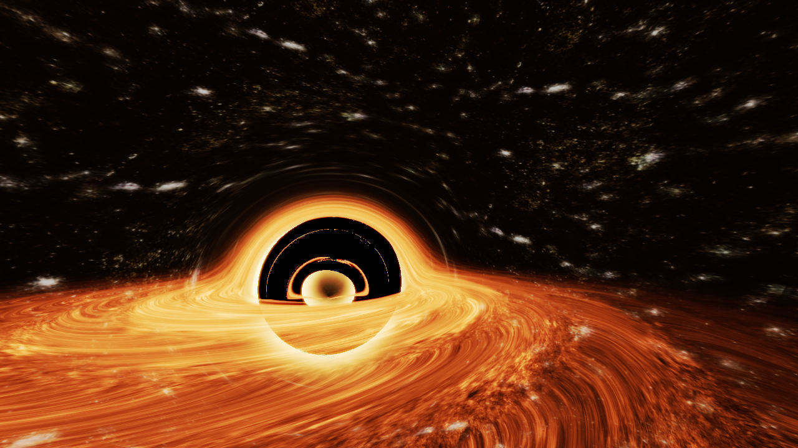
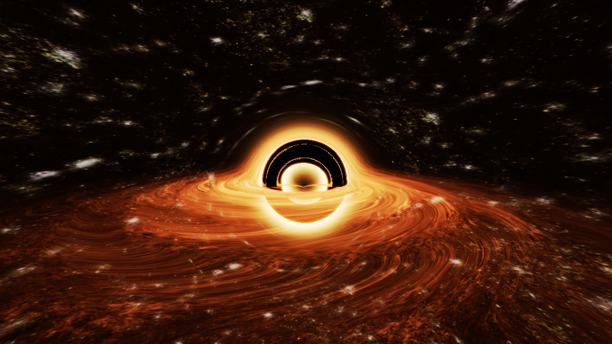
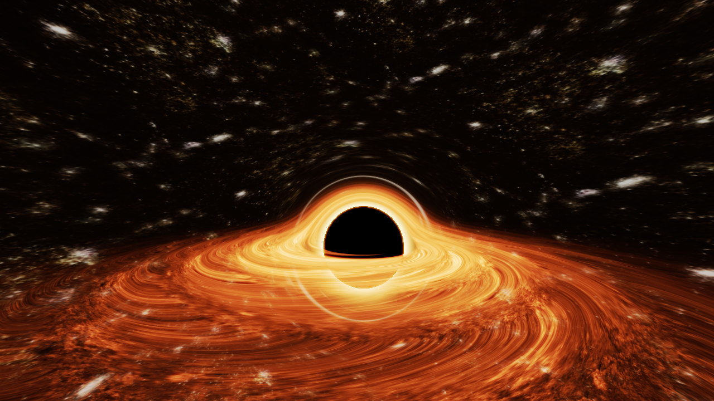

TITLE: Arbitrary Black Hole Rendering
WEB-TITLE: arbitrary-black-holes
DESCRIPTION: An interesting dive into creating problems for the sake of solving them
COVER: arbitrary-black-holes/Donut2.png
COVER-DESCRIPTION: A donut shaped black hole
DATE: 1 Mar 2024

TLDR: Approximating spacetime distortion to render the heaviest donut ever theorized. Interactive demos at the bottom.

BEGIN-CONTENT

## Getting Inspired

Last year I watched the incredible sci-fi thriller _Interstellar_ for the first time. While the movie is a narrative and visual masterpiece from start to finish, there was one scene that I just couldn't get out of my head:


_Interstellar's famous black hole "Gargantua", via [Wired](https://www.wired.com/2014/10/astrophysics-interstellar-black-hole/)_

"Gargantua", the supermassive black hole shown in the movie, captivated audiences and critics alike, and was in part the reason why the film won the 2015 Academy Award for Best Visual Effects, beating out movies from the _Planet of the Apes_, _X-Men_, _Guardians of the Galaxy_, and _Captain America_ franchises.

But Interstellar boast more than most academy award winners, as it also received **academic** acclaim in the form of two influential theoretical astrophysics papers.

"**Visualizing Interstellar's Wormhole**" and  "**Gravitational Lensing by Spinning Black Holes in Astrophysics, and in the Movie Interstellar**" were created based on the results of Interstellar. Christopher Nolan, the director behind the movie, wanted to write a compelling story involving both impossibly long distance travel and time dilation, but still wanted to make it somehow scientifically plausible. After a long search, he found answers with famous theoretical astrophysicist Kip Thorne: **wormholes** for distance, and **black holes** for time. There are far better resources to understand spacetime dilation, but in short, extremely heavy objects warp the fabric of the universe, causing reality to bend inward and time to move slower the closer you get. Both black holes and wormholes (at least as far as our theoretical knowledge of wormholes suggests) are heavy enough to warp spacetime, giving Nolan a perfect mode of plausible space and time travel.

Now most films would take this concept and create the VFX for it with shortcuts or workarounds, but _Interstellar_ isn't "most films". No, they were going for accuracy by any means necessary, which meant implementing a set of relativistic equations to simulate the light as it would actually behave. The visual effects house _Double Negative_ created a rendering engine that implemented Thorne's equations and produced nearly 800 **terabytes** of data of the most accurate depiction of a supermassive black hole ever made. Thorne was reportedly amazed by the images produced, and discovered for possibly the first time that a black hole's **accretion disk** (the trapped matter and light orbiting around it) doesn't appear as a ring, but as a folded over disk. As it turns out, the black hole warps the space around it to the point that the accretion disk is visible above and below the hole too.

Tangent aside, Interstellar was very inspiring, but I still didn't think about doing anything with it. The real inspiration was a bagel. More specifically, the bagel with everything on it, from _Everywhere, Everywhere, All At Once_.


_Bagel with everything on it from "Everything, Everywhere, All At Once"_

A bagel with everything on it would be pretty heavy, so it would probably bend light just like a black hole: assuming it stays in a shape, **what would a bagel shaped black hole look like?**

So, here's the mission statement: **build a 3D rendering engine that can render a black hole shaped like a bagel**. Where on _earth_ do you even begin?

## Building the Renderer

The first thing we need to do is choose _how_ we're going to render it. Multiple methods exist, each with their own pros and cons, and quirks of implementation which will make this project easier or harder. Lets take a look at the different methods available to us.

### Rasterization

Video games, 3D maps, and essentially any interactive 3D environment you've ever interacted with almost certainly use rasterization. It's by far the most common method for 3D rendering because it's extremely fast. Most modern GPUs have large blocks of their hardware specifically built for rasterization.


_A simple model rendered with a rasterizer, via [Wikipedia](https://en.wikipedia.org/wiki/Triangle_mesh)_

Rasterization works by representing a scene as a set of **meshes**, where each mesh is made of a set of connected triangles. Project each of these triangles onto a camera plane, add some color and a bit of math for shading, and you've got a functional rasterization engine!


_Visualization of projecting a triangle onto the camera plane, via [ScratchAPixel](https://www.scratchapixel.com/lessons/3d-basic-rendering/rasterization-practical-implementation/overview-rasterization-algorithm.html)_

This is an _extremely_ high level overview of the process, and rasterization engines can be mind numbingly complex with vertex and fragment shaders, lighting models, various modes of culling and optimization, and so much more. Modern rasterization engines like those seen in _Unity_ and _Unreal Engine_ can render millions of triangles and create practically photorealistic images 60 times per second.

Although it has potential for complexity, it also the best documented method on this list and by far the most accessible to learn and implement.

Fast, versatile, and accessible, but how does it stack up for black hole rendering? Unfortunately, not very well. The main issue is that rasterization relies heavily on straight lines. The three points of the each triangle are projected in a straight line, and those three points are then connected in the image by straight lines. Even if you could project the points of a triangle to a camera in a warped path (which most certainly cannot be done efficiently), there's no way to know how the edges connecting those points would have warped, ultimately ruining the effect. Clearly, whatever method we use needs to handle rendering on a much smaller scale...

### Casting/Tracing
Have you ever seen an animated movie or show? Congratulations, you've probably seen ray tracing! The methods used had been thought of as far back as the 16th century, but the first proper use of ray tracing was at Bell Labs in 1979 for a short film called "The Compleat Angler". Rendered as a tech-demo of sorts, the "film" is less than a minute long and showcases the first ever reflective and refractive animated computer graphics.


_A high quality screen shot from "The Compleat Angler", via [ComputerAnimationHistory](https://computeranimationhistory-cgi.jimdofree.com/compleat-angler-1979/)_

Ray tracing's claim to fame is how accurately it can simulate reality and create photorealistic images. While the scene above looks elementary now, it was created in 1979, when the most powerful computer in the world (the [Cray 1](https://en.wikipedia.org/wiki/Cray-1)) was about **27,000 times slower than an iPhone 15 Pro** (160 Megaflops v.s. 4.29 Teraflops). Unlike rasterization, ray tracing models simulate light individual light beams. The title of this section is **Tracing/Casting** because ray tracing is normally (incorrectly) used as a generalization for three types of rendering:

**Ray Casting**: By far the simplest method. It works by by sending out a single ray per pixel and reading the color value of exactly where it intersects with the scene. For certain geometries it's extremely efficient, and was actually the basis for _Doom_ and _Wolfenstein_ rendering algorithms. However, what it gains in speed, it lacks in accuracy, and raycasting is generally orders of magnitude less realistic than the other methods.


_Ray casting in "Wolfenstein 3D", via [LodeV.org](https://lodev.org/cgtutor/raycasting.html)_

**Ray Tracing**: Proper ray tracing is ray casting on steroids. Hundreds or thousands of rays are shot out per pixel, which then bounce randomly according to the properties of the materials. Once they reach their bounce limit, they trace a path from their final hit to all light sources and get the final brightness of the original pixel. Extremely accurate, but also extremely slow: it's not uncommon for cinematic grade ray-traced renders to take hours or days per image.


_A ray traced render, via [Wikipedia](https://en.wikipedia.org/wiki/Ray_tracing_%28graphics%29)_

**Path Tracing**: Path tracing is a much more modern version of ray tracing. It works on the same basis of shooting bouncing rays, but bounces rays according to mathematic equations describing how they're most likely to move as opposed to pure randomness. It's much more efficient and, for most cases, produces nearly identical results, which is why it's the most widely used of the three.


_A screenshot from Disney's introduction to path tracing, via [IAMAG Inspiration](https://www.iamag.co/disney-path-tracing-explained/)_

So with all these methods to choose from, surely one of them will work, right? Unfortunately not. While these methods are great, they still all rely on straight lines to model light. While we can use some of their rendering methods to make more realistic results, we can't use the simulation methods because, just like in rasterization, the geometry is rendered using straight line intersection equations. While significant modifications could be done, those modifications are well out of the range of possibility for most people (me included). 

If only there was some type of rendering that didn't rely on straight line intersections...

### Ray Marching
Although it has gotten far more popular over the last few years, ray marching is still a rather hidden field, even within much of computer graphics. Ray marching was first explicitly defined in [a paper from 1989](https://www.cs.drexel.edu/~deb39/Classes/Papers/rtqjs.pdf) about rendering 3D fractals. There's no exact geometry to fractals, e.g. you can't shoot a ray and calculate the exact point where it hits, so ray marching was created out of necessity. Instead of shooting a ray directly to the surface, we instead subdivide its path and step many times, checking for a close enough distance to consider an intersection.


_The original ray marching algorithm, via [Semantic Scholar](https://www.semanticscholar.org/paper/Ray-tracing-deterministic-3-D-fractals-Hart-Sandin/1be42e956f953380d2fb242ee5f3ac3e33290dc0)_

These steps are fixed for instances like volume rendering, however the real power of the technique comes when combined with **signed distance fields** or **SDF**s. SDFs are mathematical functions that describe the signed distance from the nearest point on a surface, where the distance is positive if you're outside of it and negative if you're inside (hence _signed_ distance). This gives the nearest distance from your current point to the nearest surface, which is (by some math I won't get into) the ideal distance estimator. This means that each step we make is the largest possible one, meaning that we reach the surface in the theoretical smallest amount of steps.


_A ray-marched terrain by Inigo Quilez, probably the most influential figure in the popularity and development of ray marching, via [Inigo Quilez](https://iquilezles.org/articles/terrainmarching/)_

Great! What does this have to do with black hole rendering? Well, ray marching doesn't use an exact equation or projection to reach the surface and does it in multiple steps before hitting a surface. Because of the subdivisions, we are no longer bound to a straight line: what's stopping us from changing the direction of the ray midway through?

### Past Research
_Interstellar_'s rendering engine is actually very well documented, especially with the two papers written on the subject. Their implementation models the curvature of spacetime with a set of equations and then uses a mixed form of ray-tracing and ray-marching to take slow, fixed integration steps, updating all the values of each ray using discrete Runge–Kutta–Fehlberg integration of a set of first order differential equations. If that sounds like a lot, it is! And it only gets more absurd once you see the calculations that are being done per step, per ray.


_One of four momentum calculations that's done for each ray in the original engine, via [IOPScience](https://iopscience.iop.org/article/10.1088/0264-9381/32/6/065001)_

This is just one of many operations performed, and calculations like this are the reason that each frame of the black hole and worm hole renderings took over 100 hours. If this _does_ seem up your alley, I implore you to look at the [original paper on wormholes](https://pubs.aip.org/aapt/ajp/article/83/6/486/1057802/Visualizing-Interstellar-s-Wormhole) and the [original paper on black holes](https://iopscience.iop.org/article/10.1088/0264-9381/32/6/065001). For those of us who are not theoretical astrophysicists though, this is completely out of the question. Even though copying the equations down would be possible, it would take hundreds of hours to render even a single frame on consumer hardware, and it wouldn't accomplish the original goal of a bagel shaped black hole!
  

### Educated Shortcuts
So the proper way is out of the question, but there are some shortcuts we can make. There are two _massive_ assumptions we can make that turn this project from impossible to trivial at the slight expense of ignoring about a hundred of years of physics research. Firstly, **we will assume that all gravity is approximately governed by Newtonian mechanics**. 

<div class="math-container">

$$ F_G=G*\dfrac{m_1m_2}{r^2} $$

</div>

This is an egregious assumption to make for many reasons, but modeling forces is far easier than the abstract geometry of spacetime. Secondly, **we will assume that photons behave like particles**. This one is less appalling, at least in the field of computer graphics, as all modern rendering engines (save a few experimental ones and tech demos) work based on the assumption that light is a ray, and ignores most wavelike properties. That being said, we will have to assume they have mass in order to use the gravity equation above.


_The difference between Newtonian and Relativistic gravity (from a site that no longer exists, somehow)_

While much of the accuracy is gone, these assumptions will make the project actually possible, and will still provide a result recognizable as a black hole.

Additionally, we'll be using a varying length ray marching, also known as **sphere marching**. This will vastly speed up the renderer to essentially real time while causing a theoretical minimal loss of accuracy. 


_Sphere tracing in action, via [Wikipedia](https://en.wikipedia.org/wiki/Ray_marching#/media/File:Visualization_of_SDF_ray_marching_algorithm.png)_

As can be seen above, sphere tracing allocates more steps the closer you are to an object. Since our equation for gravity is proportional to $\dfrac{1}{r^2}$, the force from gravity is stronger at nearer distances. We automatically have more steps when we are closer, meaning that when more motion is present, more detail is allocated to accurately tracking that motion.

### The Algorithm
Finally, we get to actually building the algorithm. Using elementary physics, we compile the equations as follows: 

<div class="math-container">

$$F=ma \text{, } \  F_G=G*\dfrac{m_1m_2}{r^2} \text{, and } \  r=vt$$

$$m_1a = G*\dfrac{m_1m_2}{r^2} \Longrightarrow a=G\dfrac{m_2}{r^2}$$

$$r=vt \Longrightarrow \ t=\dfrac{r}{v}$$

</div>


From there, we can employ $v=at$ to calculate the changing velocity and do the whole process over again. This means that all we need to calculate the change per step is the radius, the velocity of the particle at that step, and the mass of the attracting bodies. We have the radius from our SDF estimator, we can abritrarily set the mass of the attracting body, and we can initialize the velocity of the particle to the speed of light: we have everything we need to implement the algorithm.

When raymarching, we typically give the ray a direction and then step it a certain radius. We do the same thing here, but we use a velocity that we normalize to get the direction. Keeping a non-normalized velocity allows us to use the equation above and calculate the approximate time it took for the ray to get to its next step.

The code for implementing this in 2D is as follows:
```js
// Repeated until step radius is below a certain threshold

let vx = getVelocityX(); // X velocity of ray
let vy = getVelocityX(); // Y velocity of ray
let M = getBlackHoleMass();
let r = getStepRadius();
let G = 1; // Or 6.67e-11 with everything else scaled up

// Calculate magnitude of velocity
let velocityMagnitude = Math.sqrt(vx**2 + vy**2);

// Calculate how long the step would take
const dt = r / velocityMagnitude;

// Calculate  acceleration
const acceleration = (dt*G*M) / r**2;

// Get force direction
const ax = (target.x - nx) / r;
const ay = (target.y - ny) / r;

// Apply velocity (dt is multiplied in "acceleration")
vx += ax * acceleration;
vy += ay * acceleration;

// Calculate the new magnitude
velocityMagnitude = Math.sqrt(vx**2 + vy**2);
  
// Take a step in the new normalized direction
nx += r*(vx / velocityMagnitude);
ny += r*(vy / velocityMagnitude);
```
Because this radius is the distance from the object and SDFs allow us to represent nearly any object mathematically, there's no limit to what shape of black hole we can make, meaning the everything bagel is just a few lines of code away!

## Results
The algorithm demonstrated above was first implemented in 2D as a proof of concept which can be messed with below.

<div class="row">

<script async src="//jsfiddle.net/iBrushC/4fdwnqjx/759/embed/result"></script>

</div>

They ray will point toward your mouse, and you can use WASD like arrow keys to move around. The ray represents a beam of light and the random black scattered shapes represent black holes. The squares dotted around were to test the way light bends around non-circular bodies and to ensure that the algorithm holds for those too. The source code for this demo is available [here](https://jsfiddle.net/iBrushC/4fdwnqjx/764/).

Now for the main event. How did it turn out in 3D? In short, extremely well. Despite all of the shortcuts, effects like gravitational lensing and the curved accretion disc are still clearly visible, and most importantly, it looks cool.

<div class="row">





</div>

<div class="row">




</div>

And the best part? It runs in real time (for a reasonably modern computer) and on the web. Below is the fully functional, fully explorable final result of the project.


<div class="row" style="align-items: center; justify-content: center">

<iframe width="640" height="360" frameborder="0" src="https://www.shadertoy.com/embed/dtXSzB?gui=true&t=10&paused=false&muted=true"></iframe>

</div>

Like in the 2D demo, you can fly around with WASD, but here you can also go up with Q and down with E. 

The final project was written in GLSL through Shaderoy, a website for messing around with shaders online. You can also click and drag to look around. Unlike the 2D demo, this one uses physically accurate values for velocities, solar masses, and radii, so it should be as close to accurate as can be achieved with Newtonian mechanics. The full source code is available [here](https://www.shadertoy.com/view/dtXSzB), but bear in mind it may not be the most readable.

## Conclusion

Looking back to about 90 paragraphs ago...
> So, here's the mission statement: **build a 3D rendering engine that can render a black hole shaped like a bagel.**

Mission complete. Though some _light_ research on rendering engines (pun intended), we successfully devised and implemented an algorithm that, for all _I_ know is the first to be able to semi-accurately model non-spherical black holes.

So what next? Absolutely nothing! Projects are often done with the express intent of making some large discovery, creating a useful project, or solving a problem, but this one was the opposite: **a problem was created for the express purpose of solving it**. There's generally a pretty small overlap for each person of _important projects with direct effects_ and _projects that you'll have fun doing_, so if you only focus on doing important projects you might burn yourself out doing stuff you don't even enjoy. Plus, regardless of what, you learn something from everything you do. While I couldn't find a single practical use for a spacetime-distorting bagel renderer, I found plenty of use for the same ray marching and general rendering methods while working on medical volume rendering. A silly idea about a bagel turned out to be one of my all-time favorite projects and the ideas I learned from it turned out to be extremely beneficial down the line.

So what can be learned from this whole experience? **It's fun to do stuff for the sake of doing it**. It doesn't matter what, why, or how, but at least trying to do something is better than nothing at all. But **don't forget to leave time to let yourself get inspired**, since without taking a couple hours to watch some movies, I would have never come up with this idea in the first place. Just like the project it's talking about, there's no real higher purpose to this article, it's just a thing I'm doing because I want to be doing it, and honestly, I'm having a great time.

This ended up being about 2000 words longer than I expected, so thanks for getting this far if you did. Next blog will be out in hopefully less than 30 days and be about either fractal rendering, reinforcement learning, or DIY hacker technology.

👋