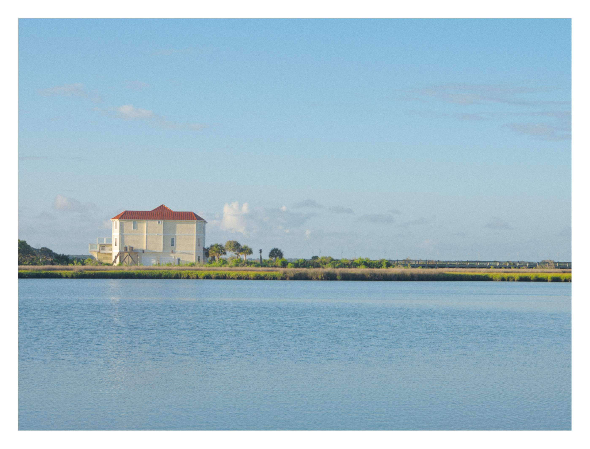
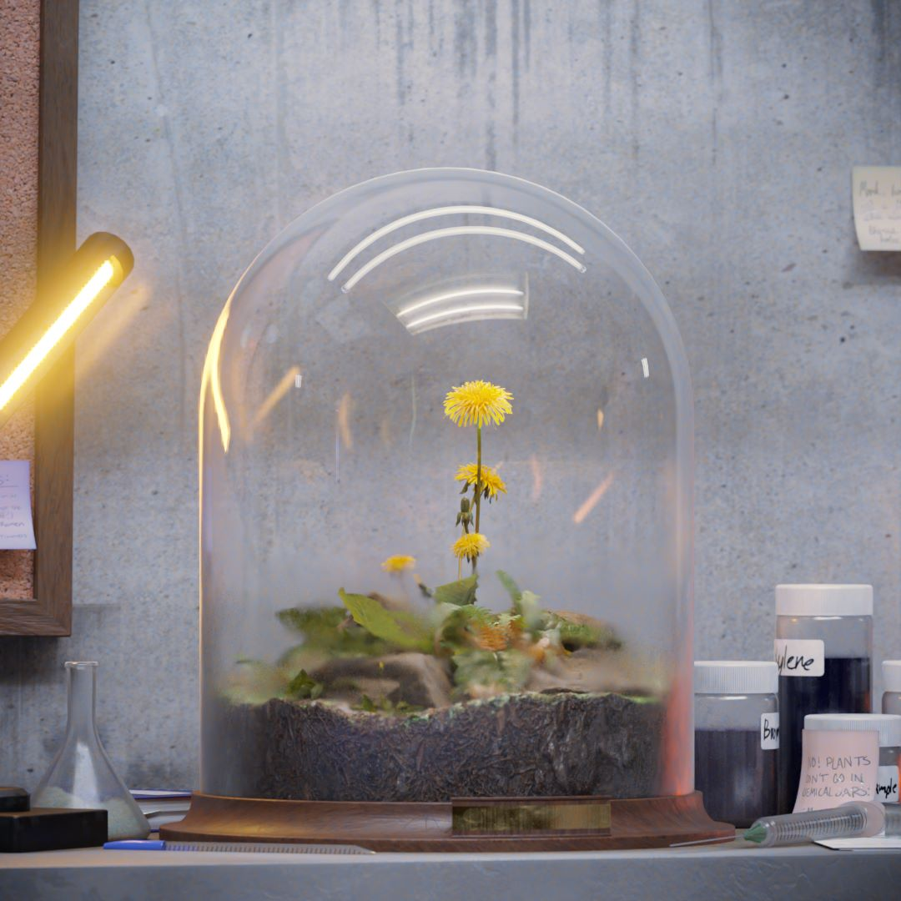
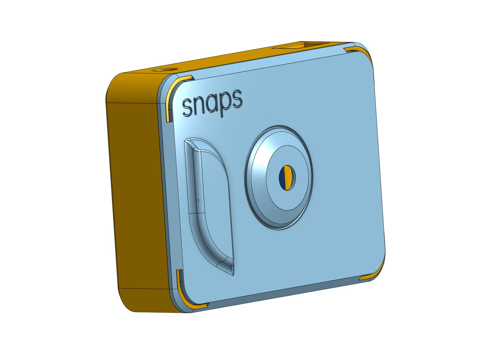
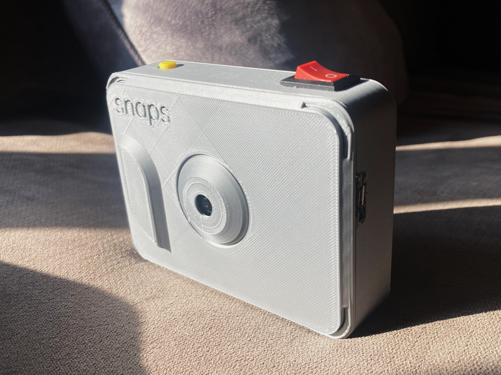
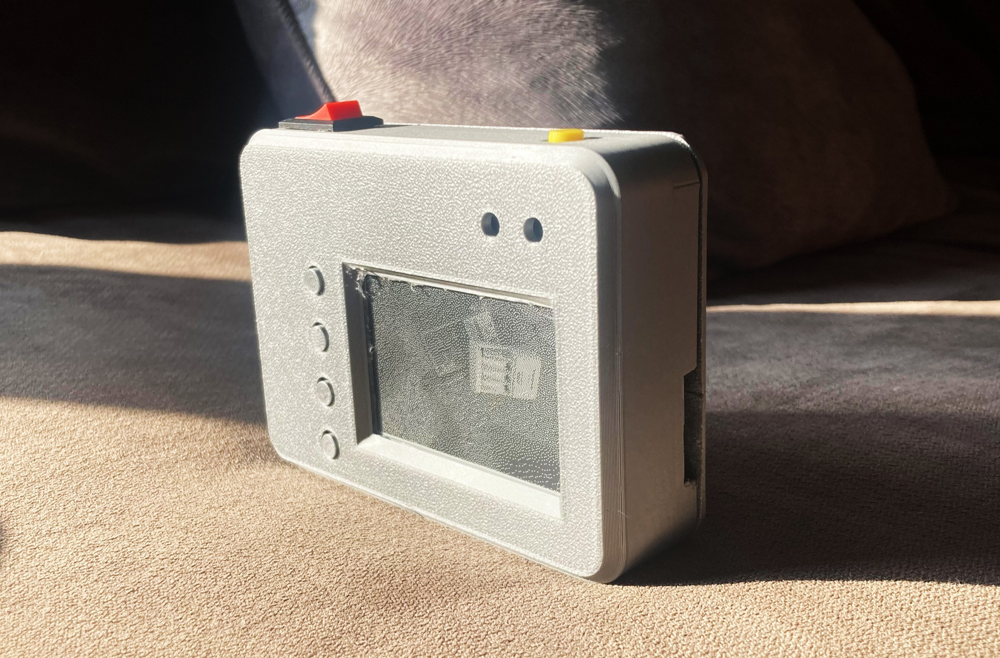
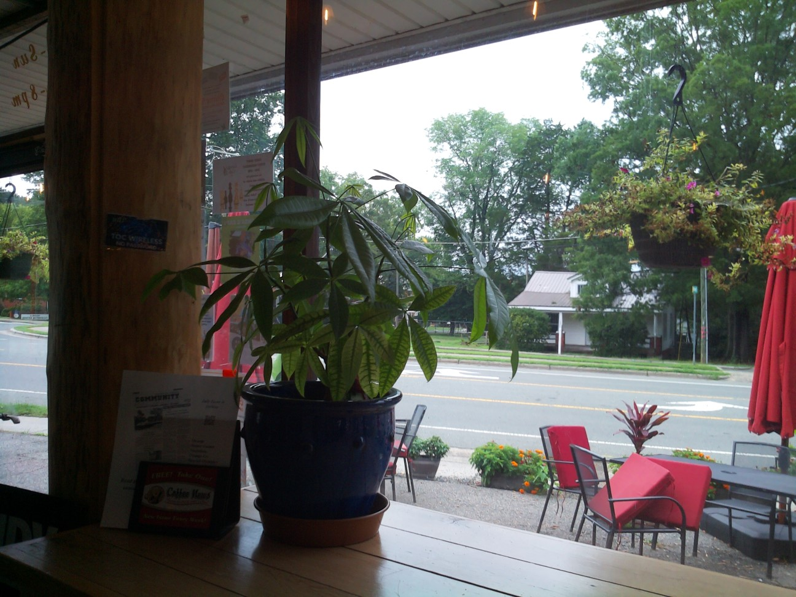
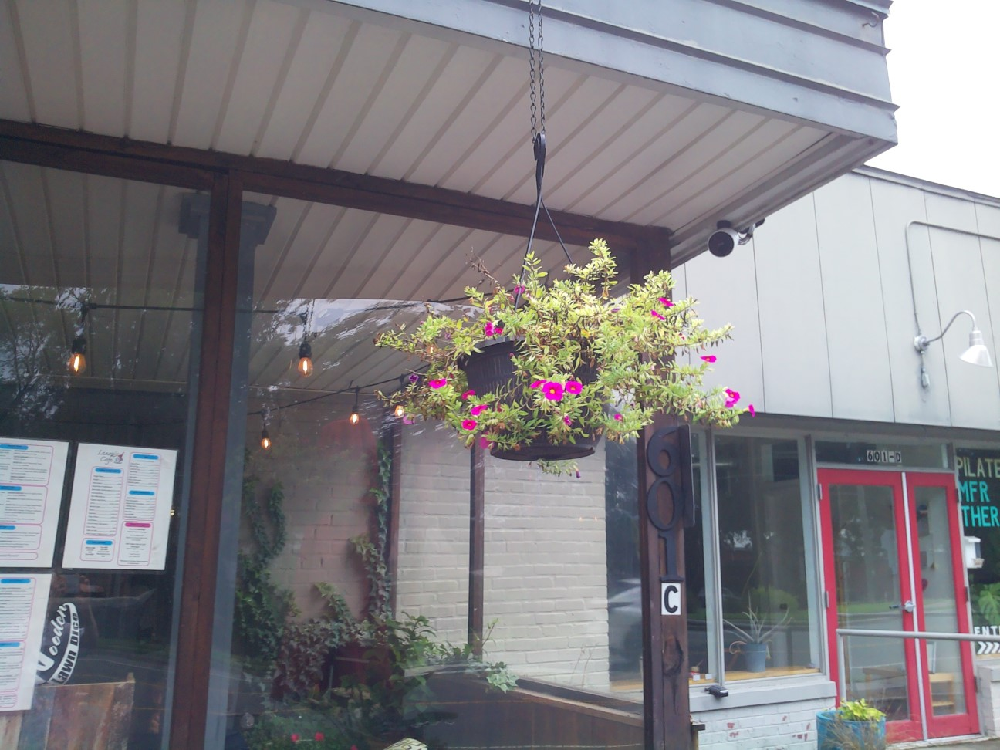
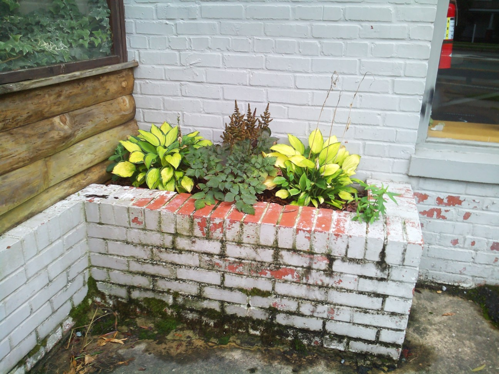

TITLE: Building A Camera
WEB-TITLE: snaps-camera
DESCRIPTION: Harnessing new technology for a film-like digital experience
COVER: snaps-camera/SNAPS_20.jpg
COVER-DESCRIPTION: The camera (Snaps) photographed by itself
DATE: 11 August 2024

TLDR: I spent a week making the perfect mix between a disposable camera and an e-reader.
BEGIN-CONTENT

## Prelude

After writing a couple, I now have a great respect anyone who regularly creates blog posts. Scopes and expectations grew and my "monthly" blog post turned into four months of toiling away and micro-tweaking. Seeing and feeling the burnout, I've decided to write a smaller, less detailed post about a project I did in the meantime.

(With any luck, the more technical post will be done by the end of this month🤞)

## Introduction

With a year abroad coming up, I decided to finally get a camera of my own. After about a month of research comparing size, price, and features, I finally landed on the Olympus EM5 Mark III. I've used it for a few months and can safely say that I love this little thing.

_One of my favorite EM5 photos so far_

The colors are stunning, the autofocus is snappy and accurate, its photos are sharp, and it only weighs a pound and a half with a lens. Incredible. Immaculate. Impeccable.

**_However..._**

There's a reason why film cameras, Polaroids, and awful 2000s digicams are making a comeback. Fundamentally, they just feel _different_. Something about having a limited number of shots, a small resolution, or next-to-no settings makes every good shot seem even better. All these restrictions force you to focus on what really matters: the moment, and how to best capture it with what you have.

Needless to say, I enjoy older methods of photography. I'd love to always carry around a Polaroid or disposable camera, but the film is extremely expensive and carrying it around can be a hassle. The ideal solution is a camera that _feels_ like film without the drawbacks of actually using it

Any reasonable person in my situation would get a digicam or maybe a [Papershoot](https://papershootcamera.com/) if they're feeling fancy. However, I am not a reasonable person, and I decided to build a camera.

## Inspiration

The key inspiration (and main design feature) of my camera is an **e-paper display**, which you've probably seen in e-readers like the _Kindle_.

### What is e-paper?

**E-paper**, short for **electronic paper** displays are exactly what they sound like: digital displays that mimic paper. It's commonly confused with **E-Ink**, however, E-Ink is a trademarked line of products where e-paper is the technology. That said, E-Ink describes the inner workings far better.

On a high level, e-paper displays show images with millions of microscopic, oppositely charged black and white particles. When placed in a dot, you have a pixel that's color can be flipped with an electric field, often supplied with individual electrodes. Create a large grid of these dots and you have an e-paper display.

_A single pixel in an e-paper display, via [Visionect](https://www.visionect.com/blog/electronic-paper-explained-what-is-it-and-how-does-it-work/#:~:text=These%20capsules%20are%20arranged%20in,to%20appear%20a%20certain%20color.)_

To prevent unwanted color changes, the particles are suspended in a viscous fluid. This means the screen can show an image even when unplugged, and only uses power when changing the display! It's an ideal technology for long-lasting, periodically changing displays like e-readers and signs.

_An e-paper display at a bus stop, via [Papercast](https://www.papercast.com/product/papercasts-new-battery-powered-e-paper-displays-break-new-ground-in-energy-efficiency-boasting-3-years-battery-life/)_

### Flickering

Unfortunately, there's no free lunch: because physical particles need to move through a thick liquid, the displays are rather slow. When updated too fast, e-paper displays are prone to **ghosting**, where reminants of past images burn into the screen. (_read more in-depth [here](https://www.visionect.com/blog/why-epaper-blinks/)_)

To combat this, manufacturers implement **flickering**, a routine that calibrates every dot before moving it into its next resting position. In exchange for an even slower refresh rate, their lifespan and consistency increase tenfold.

_E-paper display updating, via [Wikipedia Commons](https://commons.wikimedia.org/wiki/File:E-ink_display_refresh_%28animation%29.gif)\_

Seeing this flickering immediately struck me with inspiration: maybe it's just me, but this flickering is fairly reminiscent of how a Polaroid photo develops. **If I could attach an e-paper display to a digital camera, I could use this drawback as a feature and make a digital camera that truly feels like film!**

### P.S., technology is complex

This is a very high-level overview of the topic. I planned to cover the innerworkings of newer advances, but the theory behind them proved convoluted and shrowded with trade secrets.

Despite how e-paper is made out to be above, the cutting edge is a far cry from mono-color slow-updating displays. Three, six, and seven-color displays are quite common and relatively cheap, but the tech behind them isn't publicly available. I found some animations [here](https://www.eink.com/tech/detail/How_it_works), but even this is fairly high level.

_A seven-color e-paper display, via [Vilros](https://vilros.com/products/pimoroni-inky-impression-5-7-7-colour-epaper-eink-hat?variant=39847522631774&currency=USD&utm_medium=product_sync&utm_source=google&utm_content=sag_organic&utm_campaign=sag_organic&srsltid=AfmBOorlrXl6Yd_qJIAW5pcOI09SkN0FKyqg0eVGn4q8dFeKImnRIdid0EU)_

Additionally, partial display refreshes are now available on most commercial displays, allowing for fast refreshes as long as occasional calibration is done. Some brands can update as fast as 15 times per second, and a company called [DASUNG](https://shop.dasung.com/) even makes e-paper monitors and tablets.

_An e-paper display updating at 15Hz, via [Waveshare](https://www.waveshare.com/9.7inch-hdmi-e-paper.htm)_

multicolor or fast-refresh displays felt too important to leave out, but I couldn't find any detailed technical information on either, hence the less-detailed postscript.

## The Build

**Attach an e-paper display to a digital camera.** It's rather simple in concept, but the devil is in the details.

First of all, we can safely rule out modifying an existing camera to use an e-paper display. Due to different hardware, e-paper displays require an entirely different communication protocol from the displays used in most cameras. Even if you were to replace it, the camera would try treating it like a normal screen, updating it way too fast and likely breaking the display.

### Electronics

With that ruled out, the only option is to build it from the ground up. This seems scary but turns out to be it's extremely easy. There are countless camera modules and equally as many microcontrollers and single-board computers (SCBs) to pair with them. In my search, I found the [Mini ESP-CAM](https://www.seeedstudio.com/XIAO-ESP32S3-Sense-p-5639.html), a hilariously small controller and camera:

_Mini ESP-CAM, via [Seeed Studios](https://www.seeedstudio.com/XIAO-ESP32S3-Sense-p-5639.html)_

As cute as the tiny camera modules were, I remembered already had a Raspberry Pi and its associated camera module from a fish monitoring system I had set up earlier in the year. That fish was well past needing to be monitored, so the resources were better used elsewhere.

Almost every part was chosen out of convenience because "I might as well use it because I have it and it technically works." From the battery and charger to the switches and buttons, the majority of the parts were recycled from old projects or broken technology. In the end, the only thing I ended up buying was the [e-paper display](https://a.co/d/cPArgxv).

_The e-paper display I went with, via [Amazon](https://a.co/d/cPArgxv)_

After thorough searching, this was the only display that I could find that would be large enough to be visible, small enough to be portable, had software support, and had an aspect ratio that wouldn't distort the images too much. Additionally, the buttons provide a useful interface for the bare minimum functionality that the device.

In an unusual but pleasant turn of events, the electronics of this project were as easy as can be. The camera plugged in fine, the screen fit well, and the final wiring was put together start-to-finish in a day. Unfortunately, the simplicity ended here...

### Software

Remember when I said that the display I bought "had software support"? Silly me didn't check it thorougly, believing that the support provided would be _usable_ support. This mistake cost me dearly.

I sank a solid several hours into getting my display recognized, along with fixing a whole host of issues caused by the package mainly supporting the Jetson Nano. I tried about every setting I could, eventually resorting to rewriting parts of the source code to work with the Raspberry Pi.

I wasn't too surprised by the random Amazon display having questionable support and documentation, but I was _shocked_ at how inconsistent the resources for the Raspberry Pi were. If you look up "Raspberry Pi Camera Take Picture", nearly half the results on the first page still suggest using `raspistill`, a command which has been outdated for years at this point. Maybe I'm just spoiled with non-SCB development, but I had to _hunt_ for up-to-date resources for almost everything.

The good news is that once I figured out how to take pictures and use the display, everything else was a breeze. For how janky it was to set up, the display package was packed with a surprising amount of examples and convenience features. It even does automatic image scaling and conversion including **Floyd Steinburg dithering**, a fairly sophisticated algorithm for representing images with a limited color palette.

_A Floyd-Steinburg dithered image, via [Wikipedia](https://en.wikipedia.org/wiki/Floyd%E2%80%93Steinberg_dithering)_

### Hardware

I'm quite embarrassed to say that, up until recently, every part I've ever designed has been in [Blender](https://www.blender.org/). In Layman's terms, I've been using a program made for dimensionless 3D art to create real-world things that require precise dimensions. I'd previously tried to learn Fusion360 to no avail, and Blender, which I already knew, can _technically_ work just fine. I can generally get away with it, but the complex shapes and tight tolerances of this project were too problematic.

The issue is that (save a few exceptions and workarounds), Blender is a **direct modeling** software. This means that you have direct control over the geometry, being able to push and pull any section however you please. It's quick to prototype and perfect for the organic and artistic shapes found in 3D art, but tends to lack precision. Another big problem is the absence of an editable history: this means that if you want to undo that chamfer you made 20 revisions back, you're out of luck. Maintaining dimensions is a pain and likely the reason I dreaded this stuff.

_An example of what I normally make with Blender_

Almost all computer-aided design (CAD) software is built around **parametric modeling**. In this approach, geometries are built out of shapes and **features** that modify those shapes. Features are stored in an editable history, allowing you to go back and change any decision at any point, making revisions a breeze. Parametric modeling struggles to create organic shapes, so most CAD software also includes direct modeling features that can be later integrated into their parametric workflow.

Finally biting the bullet, I chose to learn [OnShape](https://www.onshape.com/) at the recommendation of friends who eat, sleep, and breathe CAD. I spent a couple of days learning the basics before jumping into designing the camera case, and was pleased to see that it was easier than I thought.

_A scary-looking design made in OnShape, via [dezignstuff](https://dezignstuff.com/what-is-onshape/)_

Now I am, for all intents and purposes, a beginner at best, but I can't help but feel that years of building 3D art models carried over astoundingly well. Though the workflows share few similarities, the ideas of modeling remain the same: extrude here, bevel there, add cutouts, revolve, etc., etc.

_The first revision of Snaps_

After a rather slow day of modeling and struggling through importing models, I sent off my completed model to be 3D printed. To literally everyone's surprise, everything fit first try! My improper knowledge of tolerances meant it didn't fit particularly well, but there's nothing a little bit of sanding and a box cutter can't fix. While my knowledge of CAD improved exponentially during this process, my understanding of mechanical construction is still greatly lacking. My _abstract_ design features an entirely hot glue and snap-fit joint construction which perfectly embodies the phrase "technically works".

After some rather lengthy assembly, the camera was finished! Inspired by the snap-fit nature of the case, I creatively named it "snaps."

_The finished camera, janky fixes and all_

The finished design is as simple as can be. Taking photos and looking at them, the camera's only features, are controlled by five buttons on the back and top. A small grip on the front makes it surprisingly comfortable to hold, and an accessory slot on the back is included for an optional thumb grip or optical viewfinder.

## Retrospective

As expected from a speedy challenge project, many mistakes were made. Before getting to the photos, I'd like to review the numerous things that could have gone better and the takeaways from each one.

### Right Tool For the Right Job

As I mentioned, 90% of the camera is a mish-mash of parts I had lying around. This was a great idea for getting parts quickly and economically but came at the detriment of the quality of the project. The main issue is the Raspberry Pi: it's too large, power-hungry, and generally overkill for what I'm trying to do here. Running an entire operating system makes it slow to boot and quick to drain the battery, worsening the user experience significantly. I could have gotten around these with a bare-metal boot to a C++ program, but that's an absurd fix to a problem that doesn't need to exist.

I should have recognized the relatively minimal processing power needed and committed to an ESP32-CAM module. The added $15 would have likely resulted in a smaller, snappier, and longer-lasting shooting experience.

_The modules I'll be using for for Snaps V2, via [Amazon](https://www.amazon.com/HiLetgo-ESP32-CAM-Development-Bluetooth-Raspberry/dp/B07RXPHYNM)_

### Identity Crisis

Lacking a complete plan before starting, and my goals for the camera kept changing as I built it. Switching back and forth between everyday carry, travel camera, and tech demo created a strange chimera-like mix that doesn't quite fit into any category. An idea beyond "camera with e-paper display" probably would have assisted the entire process greatly.

### Tolerances

From my background in 3D modeling for art, tolerances are a fully foreign concept. When I want parts to snap together in a product rendering, I make them exactly large enough to snap together. This approach did _not_ serve me well, and, as it turns out, most 3D printers don't have sub-millimeter precision! This worked in my favor for the snap-fit parts, but screen dimensions and cutouts were far from perfect off the printer. Learning a bit more about dimensions would have saved me a good hour of sanding.

### Due Diligence

Research, research, research. As tempting as it is, blindly rushing into projects is a great way to waste a lot of time. A quick Google search would have revealed that someone's already made a far better version of this project! Hackaday user [Cameron](https://hackaday.io/Cadowd) created an [e-paper "film" camera](https://hackaday.io/project/189530-e-paper-instant-camera) that's far more stylish, well thought out, and functional than mine.

_Cameron's objectively better camera, via [Hackaday](https://hackaday.io/project/189530-e-paper-instant-camera)_

It includes a sleek, portable design and a screen that can be detached and used as a fridge magnet, all driven by a custom circuit board. This was entirely out of my scope, but I'm not saying I should have given up on the project. Achievable or not, this would have been an awesome inspiration and opportunity to learn from those more experienced.

## The Photos

Snaps might not create the best photos, it may be a Frankenstein-ed mashup of previously broken parts, and it may not be the most attractive thing in the world, but it sure is fun to shoot with.

I'm happy to say that it's every bit as fun as I imagined. Settings, focus, and framing get tossed aside for simplying taking the picture as well as you can.

The paper display does wonders. Watching the shot fade in is genuinely exciting, and as a nice surprise I found it had the experience of a Polaroid _and_ a disposable camera. There's a satisfaction as you watch the image fade into view on the screen, but it doesn't show you the full picture. Once you get home, you get to "develop the film" and see all your pictures in their full glory. Though I must admit I still prefer the real thing, this is a pretty solid film alternative.

## Closure

I've only taken Snaps out a few times thusfar, but every time I have its been a fun hour-or-so of shooting. Each time, I notice another bug, another inaccuracy, another feature that could be improved, and every time I think about how much better it could be. And yet, these are all positive thoughts; I don't dislike Snaps because of it's flaws, rather I enjoy it enough to want to improve on them. With everything I've learned, I think Snaps V2 could be both seriously fun and practical.

Though I'm not exactly satisfied with the final product, this has been one of my favorite projects to date for a more personal reason. Since starting college, the expectation to work on important, meaningful projects has been consuming me: my hobby projects have morphed into resume-builders and feel decreasingly refreshing by the day. This is the first time in nearly a year that I've sat down and for a week and worked on something for no reason other than _I think it would be fun_.

I'll no doubt go back to my endless grind --- this blog post is already part of that --- but it felt good to do something for myself. I had fun with this project, I'm glad I did it, and I'd love to do more like it once I can finally get the time.

👋
